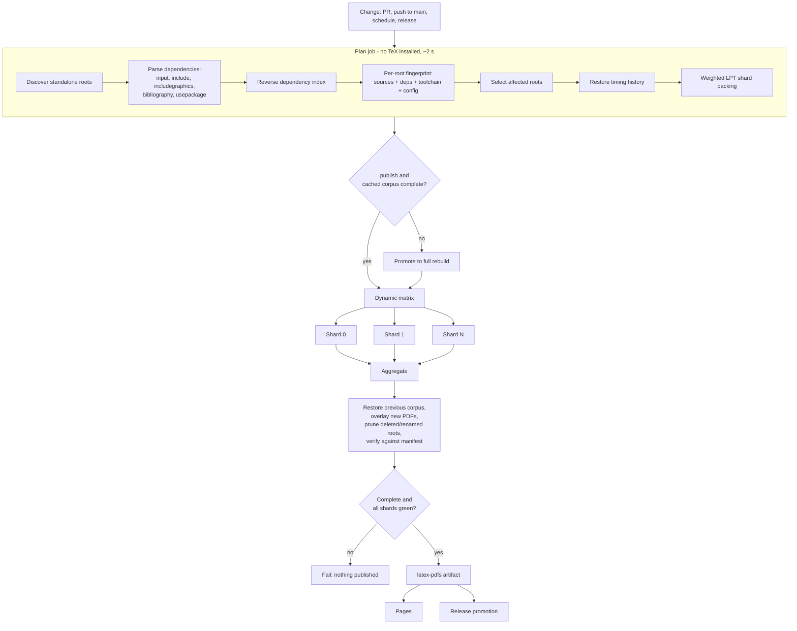

# LaTeX Build System

This document describes the build system **as implemented**. Figures come from
measurements taken on this repository; where a number is an estimate it says so.

Repository scale (measured, 2026-08):

| Metric | Value |
| --- | --- |
| Tracked files | 4,974 |
| Files under `src/` | 4,894 |
| `.tex` files | 3,074 |
| **Standalone LaTeX roots** | **3,068** |
| `.puml` diagram sources | 265 |
| Committed rendered diagrams | 535 PNG + 535 SVG |
| Shared style modules | 14 `.sty` |
| `.sty`/`.cls` files under `src/` | 0 |
| Roots using `minted` | 218 |
| Roots using `\includegraphics` | 11 |
| Bibliography files | 0 |
| `src/` on disk | 333 MB |

Roots per top-level category:

| Category | Roots |
| --- | --- |
| cornell-notes | 2,778 |
| architecture | 83 |
| security | 75 |
| devops | 45 |
| programming | 30 |
| startups | 14 |
| game-development | 12 |
| personal / mathematics | 9 each |
| documentation | 5 |
| data-systems | 4 |
| electronics / business-analysis | 2 each |

Regenerate these with `make list-roots` and `make list-categories`.

---

## 1. What made builds take four-plus hours

### 1.1 The dominant cause: a recursive kpathsea path over `src/`

`latexmkrc` and `latex_build.resolve_texinputs()` both placed a **recursive**
entry over the entire content tree on `TEXINPUTS` (and `BIBINPUTS`/`BSTINPUTS`):

```perl
"$root/src//",   # '//' = kpathsea recursive descent
```

kpathsea re-walks every recursive entry on each lookup, and `latexmk` performs
one lookup per recorded dependency — the `.fls` file for a *one-page* Cornell
note lists 1,433 inputs. Every document therefore re-`stat`ed the whole
4,894-file `src/` tree thousands of times.

Measured on a single small document (identical file, only `TEXINPUTS` differs):

| `TEXINPUTS` | real | user | sys |
| --- | --- | --- | --- |
| with `src//` | **63.4 s** | 8.9 s | **54.5 s** |
| without `src//` | **2.1 s** | 1.8 s | 0.3 s |

The cost was almost entirely *system* time — directory traversal, not
typesetting. And the entry resolved nothing: **there are zero `.sty`/`.cls`
files under `src/`**. Graphics and `\input` use document-relative paths, which
do not consult `TEXINPUTS`.

This scaled with repository size, which is exactly why a system "designed for a
smaller repository" degraded so badly:

```
3,068 roots x 63.0 s = 53.7 CPU-hours   (at JOBS=4 -> ~13 h wall)
3,068 roots x  2.3 s =  2.0 CPU-hours   (at JOBS=4 -> ~30 min wall)
```

**Fix:** the recursive `src//` entry was removed from `latexmkrc` and
`resolve_texinputs()`. A regression test fails if it is reintroduced.

### 1.2 Every push to `main` compiled the corpus twice

`latex-ci.yml` (changed build) and `latex-pages.yml` (full `publish` build) both
triggered on `push` to `main` with overlapping path filters. `latex-release.yml`
then rebuilt the same commit a third time.

**Fix:** `latex-ci.yml` is pull-request only. `latex-pages.yml` is the single
authoritative build for `main`. `latex-release.yml` promotes the artifact from
the authoritative build of the exact release commit and rebuilds only when no
such artifact can be proven to exist.

### 1.3 Everything ran on one runner

The old reusable workflow had a single `build` job with `jobs: 4`. There was no
matrix, no sharding and no cache of any kind — the "optimizations" described in
the previous version of this document were not implemented.

**Fix:** a planner job emits a weighted shard matrix; shards build in parallel.

### 1.4 `build-changed` was not dependency-aware

It only considered changed paths whose suffix was `.tex`, `.sty` or `.cls` —
images, data files and diagrams selected nothing. Its selection was
`O(changed x roots)` with a full re-parse of every root per changed file, and it
escalated to a **full rebuild** for any change under `.github/`,
`tooling/scripts/` or `src/common/`.

**Fix:** a reverse dependency index built in a single pass (1.5 s for the whole
repository).

### 1.5 Other measured costs

- **PlantUML** was re-rendered on *every* LaTeX build: 265 diagrams x 2 formats
  = 530 separate JVM start-ups, plus apt-installing Java, Graphviz, curl and jq
  on every build runner — even when no diagram had changed. Rendered PNG/SVG are
  already committed to the repository.
- **Artifacts**: successful builds uploaded 3 log files per root (~9,200 files),
  and PDFs were re-deflated during upload despite already being compressed.
- **`CLEAN_OUTPUT=true`** was hard-coded in the composite action, destroying
  reusable state before every invocation.
- **Diagnostics**: `find`, `du -ah` and `sort` over the whole tree ran on every
  successful build.

---

## 2. Architecture



Layering is unchanged — GitHub Actions still delegates to the repository-owned
build engine:

```
GitHub workflow -> reusable workflow -> composite action
                -> Makefile -> tooling/scripts/latex_build.py -> latexmk
```

### Workflow responsibilities

| Workflow | Trigger | Mode |
| --- | --- | --- |
| `latex-ci.yml` | pull request, dispatch | `changed`, no publish |
| `latex-pages.yml` | push to `main`, weekly cron, dispatch | `changed` + publish (cron: `full`) |
| `latex-release.yml` | release, dispatch | promote artifact; rebuild only as fallback |
| `render-plantuml.yml` | `.puml`/`.iuml`/plantuml styles change | diagram rendering only |
| `build-ci-image.yml` | dispatch, Dockerfile change | publishes the pinned TeX image |
| `_build-latex.yml` | `workflow_call` | plan -> shards -> aggregate |

---

## 3. Incremental selection

`tooling/scripts/build_graph.py` extracts, per root, the transitive closure of
`\input`, `\include`, `\subfile`, `\includegraphics` (honouring
`\graphicspath`), `\inputminted`, `\addbibresource`/`\bibliography`, and
`\usepackage`/`\RequirePackage` resolved against the repository style trees.

Measured selection behaviour:

| Changed path | Roots selected | Reason |
| --- | --- | --- |
| one Cornell note | 1 | direct |
| `tooling/styles/latex/financial.sty` | 3 | semantic module |
| `tooling/styles/latex/cornell-notes.sty` | 2,761 | semantic module |
| `tooling/styles/latex/base.sty` | 2,930 | transitive base style |
| `tooling/latex/style.sty` | 2,930 | house style |
| `latexmkrc` | 3,068 | global foundation |
| `README.md` | 0 | not a build input |

**Correctness rule: when in doubt, include.**

- Global foundation changes (`latexmkrc`, `Makefile`, `tooling/scripts/**`,
  `.github/actions/**`, `_build-latex.yml`) select every root.
- An asset (image, `.puml`, data file) that static parsing cannot attribute to
  any root — documents reference generated diagrams through wrapper macros such
  as `\safeincludegraphics{png/#2.png}`, whose argument is not a literal path —
  selects every root in the nearest ancestor directory that contains roots. This
  bounds the blast radius without ever skipping a genuinely affected root.

### Fingerprints

```
fingerprint(root) = sha256(
    BUILD_CONFIG_VERSION + toolchain version
  + for each of [root source, transitive deps] : path + sha256(content)
)
```

The toolchain version comes from `pdflatex --version` via the `setup-latex`
action, so a TeX Live upgrade invalidates every fingerprint. This distinguishes
"source unchanged but a dependency changed" from "entirely unaffected", and
deliberately avoids a repository-wide cache key that any single edit would bust.

---

## 4. Sharding

Document build times are strongly **bimodal** — trivial notes at ~2.2 s next to
minted/graphics-heavy documents at 4 s+ — so count-based sharding produces
long-tail shards. Shards are packed with **longest-processing-time-first** (LPT,
makespan within 4/3 of optimal) using per-root durations persisted in
`tooling/manifests/build-timings.json` and restored from the Actions cache.

Timings are merged with exponential smoothing (`merge-timings`) after every run,
so balance improves over time. Without history, a uniform default weight is used.

Independent concurrency knobs, tunable without redesigning the workflow:

| Knob | Meaning | Default |
| --- | --- | --- |
| `max-shards` | upper bound on shards created | 12 |
| `max-parallel-shards` | shards running concurrently | 12 |
| `local-build-jobs` | concurrent `latexmk` processes per runner | 4 |
| `min-roots-per-shard` | prevents setup-dominated shards | 25 |

Total concurrency is `max-parallel-shards x local-build-jobs`. Raising these is
not free: each shard pays toolchain provisioning, so tiny shards are dominated by
setup. `min-roots-per-shard` collapses the matrix for small changes — a
one-document PR runs a single shard, not twelve.

---

## 5. Caching

| Cache | Key | Purpose |
| --- | --- | --- |
| apt archives | OS + `setup-latex/action.yml` hash | removes package download time |
| timing history | `latex-timings-v1-<sha>` + prefix restore | shard balancing |
| PDF corpus | `corpus-pdfs-v1-<sha>` + prefix restore | incremental publication |
| corpus manifest | `corpus-manifest-v1-<sha>` + prefix restore | cheap completeness gate |

Safety properties:

- A stale PDF is **never** published. The aggregate step prunes PDFs whose root
  no longer exists and fails if any expected PDF is missing.
- Cache misses degrade to a full rebuild, never to a partial deploy.
- Fingerprints and cache keys both incorporate the toolchain version.

LaTeX auxiliary files (`.aux`, `.fdb_latexmk`, `.fls`, `_minted-*`) are **not**
cached. With the `TEXINPUTS` defect fixed a cold document build is ~2.3 s;
restoring, validating and re-saving thousands of small aux files across shard
runners would cost more than it saves, and stale aux state is a classic source of
wrong output. This is a deliberate, revisitable decision.

### `CLEAN_OUTPUT` semantics

`clean-output` is now an input on the `build-documents` action rather than a
hard-coded `true`:

| Build kind | Behaviour |
| --- | --- |
| clean full verification (weekly cron / dispatch `full`) | fresh output tree |
| incremental CI shard | fresh *shard* output tree; each shard is isolated |
| incremental publication | previous corpus restored, new PDFs overlaid |
| recovery/fallback | promoted to full rebuild before anything is published |

---

## 6. Publication safety

Pages always receives the **complete current corpus**, never only the changed
documents:

```
restore previous validated corpus (cache)
  -> overlay freshly built PDFs
  -> remove PDFs for deleted/renamed roots
  -> verify against the expected root manifest
  -> generate index -> deploy
```

The completeness decision is made **in the planner, before any compilation**: if
the cached corpus manifest is missing, unreadable or does not cover every
currently expected PDF, the build is promoted to `full`. A partial corpus can
therefore never reach the deploy step. The aggregate job re-verifies and fails
the workflow if anything is still missing.

`concurrency: group: pages, cancel-in-progress: true` prevents an older commit
deploying after a newer one.

---

## 7. Failure semantics

- `fail-fast: false` on the shard matrix, so every shard reports.
- No `|| true` around any required compilation step.
- A single failed required document fails the workflow.
- An unexpected exception in one document is recorded as that document's failure
  instead of aborting its shard.
- The aggregate step fails on: any failed shard, any failed document, fewer shard
  reports than shards, a selected root that produced no PDF, or (when publishing)
  an incomplete corpus.

Reported per run (`build-report.md`, `build-aggregate.json`): total/selected/
skipped/attempted/succeeded/failed roots, shards reported, PDFs present vs
expected, stale PDFs removed, missing PDFs, slowest shard wall time, total
compile time, failure clusters and the slowest 25 documents.

---

## 8. PlantUML

Diagram rendering is decoupled from document compilation:

- `render-plantuml.yml` triggers only on `.puml`/`.iuml`/plantuml-style changes,
  commits the rendered output, and the resulting push drives the normal
  dependency-aware rebuild of the documents that consume those diagrams.
- LaTeX shards install Java/Graphviz/PlantUML **only** when the planner detects
  that diagram sources changed in the same diff.
- Rendering is incremental (outputs newer than source and config are skipped) and
  batched by directory/config/format, replacing one JVM start per
  (diagram x format) with one per batch: measured **259 diagrams -> 24 JVM
  invocations**, with 381 outputs skipped as already current.

---

## 9. Minted isolation

Unchanged and deliberately preserved: `-shell-escape`, Pygments, and a
per-document `_minted-<stem>` directory. Parallel workers never share a minted
directory, and generated wrapper files are per-document
(`.<stem>.latex-build-wrapper.tex`) and excluded from root discovery.

---

## 10. Artifacts

- Per-document `stdout`/`stderr`/`.log` copies are deleted for **successful**
  documents (~9,200 files removed from a full-build artifact); failure logs are
  always retained.
- PDF artifacts upload with `compression-level: 0` — PDFs are already compressed,
  so deflating thousands of them is pure CPU on upload *and* download.
- Shard PDFs (3-day retention) are separated from the published corpus (14 days)
  and from diagnostics/timings.
- The whole-tree `find`/`du`/`sort` diagnostic step was removed.

---

## 11. Developer commands

All existing contracts are preserved:

```bash
make list-roots
make list-categories
make build-all
make build-parallel JOBS=8
make build-category-<name>
make build-changed BASE_REF=<sha> HEAD_REF=<sha>
make render-plantuml
make publish
make publish-parallel JOBS=8
make clean
make distclean
```

New:

```bash
make plan PLAN_MODE=changed|full MAX_SHARDS=12    # affected roots + shard matrix
make build-shard PLAN=<plan.json> SHARD_INDEX=0   # build one shard
make verify-corpus PLAN=<plan.json>               # validate published PDFs
make stage-pages                                  # build the Pages site tree
```

Underlying CLI: `plan`, `build-selection`, `aggregate-shards`, `verify-corpus`,
`check-corpus-manifest`, `plan-outputs`, `merge-timings`.

---

## 12. Optional pinned toolchain image

`.github/docker/texlive/Dockerfile` freezes the exact package set.
`build-ci-image.yml` publishes it to GHCR with an explicit version tag; pass that
tag as `container-image` to `_build-latex.yml` and `setup-latex` skips apt
provisioning. Always pin a version — never `latest` — because the tag feeds build
fingerprints and cache keys.

This is opt-in: benchmark image pull time against apt provisioning before
adopting it.

---

## 13. Benchmarks

Measured locally on 8 cores. Per-document figures are the direct cause of the CI
wall-clock change; CI shard counts are applied on top.

**Per document** (median of a 27-document sample spanning trivial notes,
minted-heavy documents and all 11 graphics-using documents):

| | Before | After | Change |
| --- | --- | --- | --- |
| Median | 63.2 s | 2.32 s | **-96.3%** |
| Mean | 46.3 s | 2.83 s | -93.9% |
| Failures | 0 | 0 | — |

**Selection** (documents compiled per scenario, out of 3,068):

| Scenario | Before | After | Avoided |
| --- | --- | --- | --- |
| A: one `.tex` changed | 3,068 (Pages full publish) | 1 | 3,067 |
| B: several roots in one area | 3,068 | = number changed | ~3,060 |
| C: one local dependency (image/fragment) | 3,068 | dependent roots only | ~3,060 |
| D: one semantic style module (`financial.sty`) | 3,068 | 3 | 3,065 |
| D': `cornell-notes.sty` | 3,068 | 2,761 | 307 |
| E: house style / `base.sty` | 3,068 | 2,930 | 138 |
| E': `latexmkrc` / build tooling | 3,068 | 3,068 | 0 (correctly global) |
| F: clean full rebuild | 3,068 | 3,068 | 0 (by definition) |

Duplicate-build elimination removes a second full compilation of every push to
`main` on top of the above.

**Scenario F, measured locally** (clean full rebuild, 3,068 roots, `JOBS=8`):
see `RESULTS.md` for the recorded figure, and `public/logs/build-summary.json`
after `make build-parallel JOBS=8` to reproduce it.

**Instrumentation for GitHub-hosted measurement.** Local hardware cannot
reproduce GitHub runner timing, so every run emits machine-readable data —
`build-timings.json` per shard (per-root durations, mean/median/p90/p95/p99/max,
slowest 25) and `build-aggregate.json` per run (shard wall time, total compile
time, corpus counters) — plus a job-summary table. The first post-merge run
establishes the authoritative CI baseline.

### Expected CI wall clock

With per-document cost cut ~27x and 12-way sharding on top:

| Scenario | Before | Expected after |
| --- | --- | --- |
| Isolated PR change | 4 h+ | single-digit minutes (setup-dominated, 1 shard) |
| Small affected set | 4 h+ | well under 15 minutes |
| Full rebuild | 4 h+ | provisioning + ~(2.0 CPU-h / (12 x 4)) |

The remaining floor for small changes is toolchain provisioning, not
compilation — which is what the optional pinned image addresses.

---

## 14. Remaining risks

1. **Macro-indirect asset references.** Handled by the directory-subtree
   fallback, which is conservative (may over-select) rather than unsafe.
2. **Cache eviction.** Degrades to a full rebuild; correctness is preserved,
   wall clock is not.
3. **Pre-existing PlantUML source errors.** At least
   `src/devops/platform/business-applications/suitecrm-self-hosting-architecture.puml`
   fails to render (verified identical before and after this work — a diagram
   content bug, not a pipeline regression). `render-plantuml.yml` runs with
   `fail-on-error: true` and will report it.
4. **`min-roots-per-shard` tuning.** The default of 25 is a starting point;
   revisit once real CI timing history accumulates.
5. **No aux-file caching.** Deliberate — see §5.

## 15. Recommended next optimizations

1. Publish and adopt the pinned container image; provisioning is now the dominant
   fixed cost for small changes.
2. Re-tune `max-shards`/`local-build-jobs` from real runner timing history,
   optimizing runner-minutes rather than wall clock alone.
3. Skip roots whose fingerprint matches the last successful build and whose PDF
   is already in the restored corpus — cheap now that fingerprints exist.
4. Fix the failing PlantUML diagram sources.
